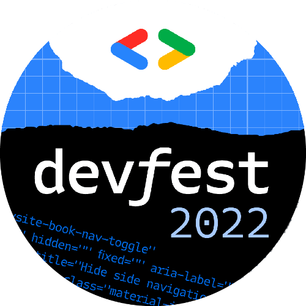
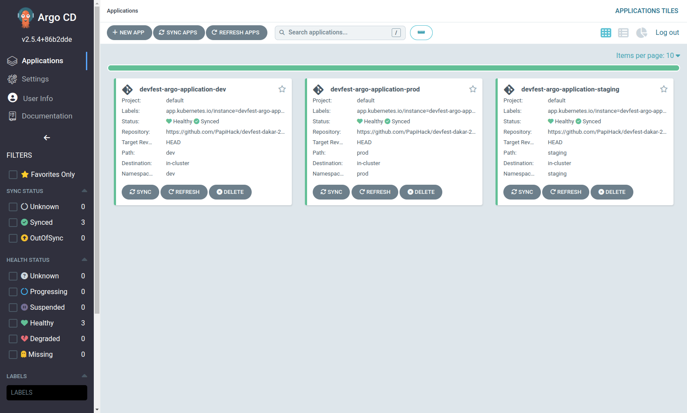
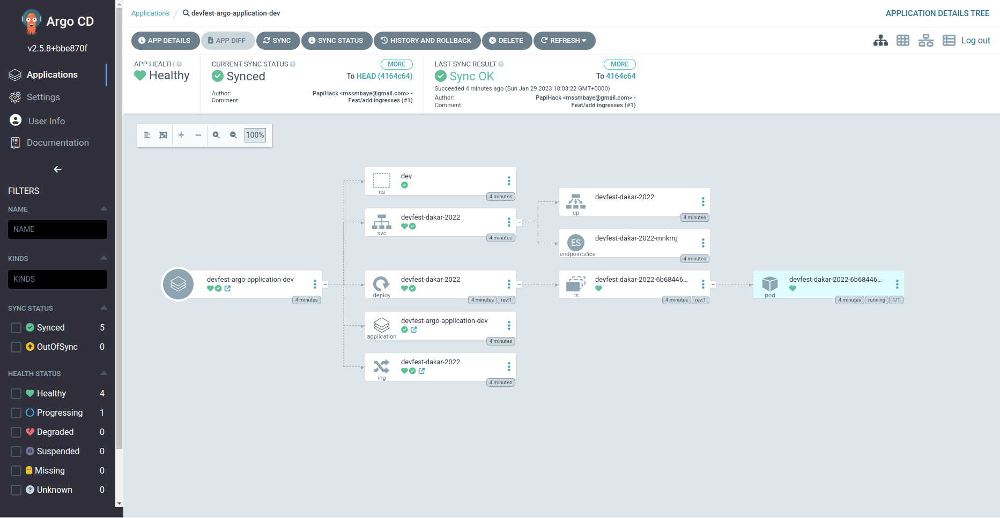

# 🚀 DevFest Dakar 2022 - GitOps Demo 🚀

<p align="center">
  <a href="https://gdg.community.dev/events/details/google-gdg-dakar-presents-devfest-dakar-22/" target="blank"></a>
</p>

[](https://img.shields.io/badge/docker-3776AB?style=for-the-badge&logo=docker&logoColor=white)
[](https://img.shields.io/badge/kubernetes-3776AB?style=for-the-badge&logo=kubernetes&logoColor=white)
[](https://img.shields.io/badge/argo-3776AB?style=for-the-badge&logo=argo&logoColor=white)
[](./LICENSE)
[](https://github.com/ellerbrock/open-source-badges/)

This repo contains the `GitOps` code of my demo at `DevFest Dakar 2020` on `Continuous Deployment and GitOps in Kubernetes with ArgoCD`.


You'll find the slides at <https://meissa-devfest-dakar-2022-prez.netlify.app>.

## Content

You'll find the following directories in this project :

- `infra`: contains manifest files in order to setup a local kubernetes cluster.
I often use [Kind](https://kind.sigs.k8s.io/docs/user/quick-start/) to create local kubernetes cluster for experimenting and learning new stuff. You can install it and Run the following command in order to create one :

```bash
kind create cluster --config infra/cluster-setup.yaml --name devfest-dakar-2022
```

- The other folders `dev`, `staging` and `prod` host respectively the k8s manifest files for the [spring-boot demo app](https://github.com/PapiHack/devfest-dakar-2022-demo-app).

## Up and Running

- First of all, you need to install `kubectl` command line tool for interacting with your k8s cluster. Depending on your system, you can install it from the following link : <https://kubernetes.io/docs/tasks/tools/>.

- Then you can install [Kind](https://kind.sigs.k8s.io/docs/user/quick-start/) and create a local k8s cluster by running the following command :

```bash
kind create cluster --config infra/cluster-setup.yaml --name devfest-dakar-2022
```

- After creating your k8s cluster, now you can install [ArgoCD](https://argo-cd.readthedocs.io/en/stable/) in it :

    - Create a dedicated namespace for `ArgoCD` with the following command :

        ```bash
        kubectl create namespace argocd
        ``` 
    - Then run the command below for deploying `ArgoCD` in your cluster :

        ```bash
        kubectl apply -n argocd -f https://raw.githubusercontent.com/argoproj/argo-cd/stable/manifests/install.yaml
        ``` 

- Run this command in order to verify if all `ArgoCD` pods are running before going further :

```bash
kubectl get pods -n argocd
```

- If all pods are running, you can open a new terminal and use a `port-forwarding` to connect to the API server without exposing the service with the command below :

```bash
kubectl port-forward svc/argocd-server -n argocd 8080:443
```

🚨 The API server can then be accessed using <https://localhost:8080> 🚨

- In order to access the `ArgoCD` dashboard, you'll need to authenticate yourself. The default `username` is `admin` and the password is stored in a `secret`. So to get the password, open a new terminal and run the command :

```bash
kubectl -n argocd get secret argocd-initial-admin-secret -o jsonpath="{.data.password}" | base64 -d; echo
```

- Now, you can execute the command below in order to create your `Argo Applications` :

```bash
kubectl apply -f dev/argo-dev-app.yaml -f staging/argo-staging-app.yaml -f prod/argo-prod-app.yaml
```

- Go to the `ArgoCD` dashboard at <https://localhost:8080> and you'll see your deployed apps 😎.

<table>
    <tr>
        <td></td>
        <td></td>
    </tr>
</table>

- If you want to clean up and delete the cluster, you can run the following command :

```bash
kind delete cluster --name devfest-dakar-2022
```


## Contributing

Feel free to make a PR or report an issue 😃

Oh, one more thing, please do not forget to put a description when you make your PR 🙂

## Author

- [M.B.C.M](https://itdev.sn)
[](https://twitter.com/the_it_dev)

